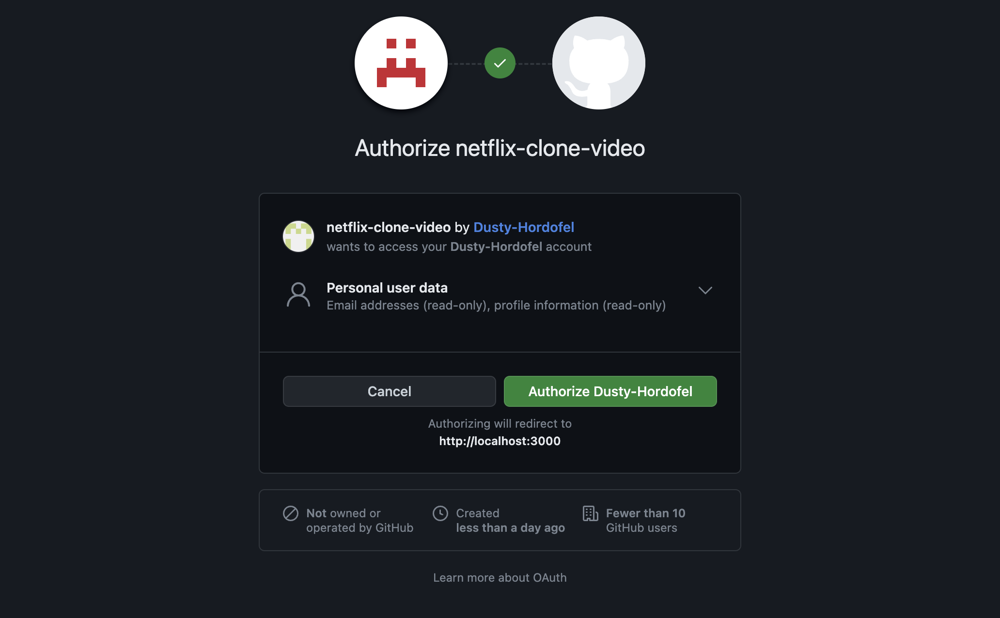
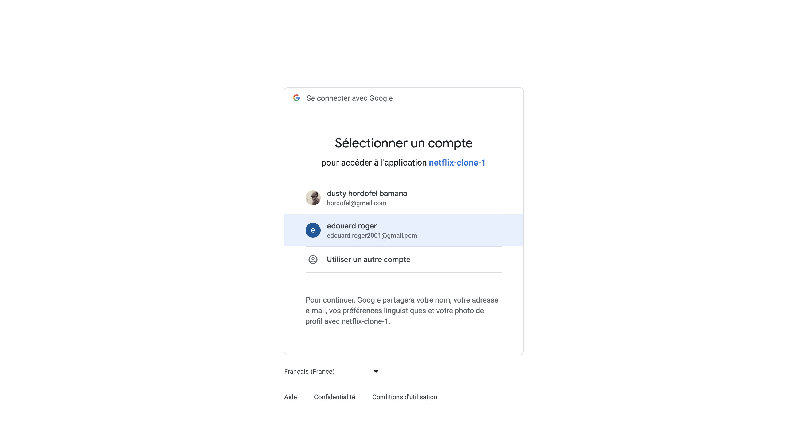

## Section 1: Folder Structure

### 1. Define a folder structure

- create a folder using Nextjs without src and app folder

```bash
npx create-next-app --typescript
```

### 2. install tailwind css

- install [Tailwind CSS](https://tailwindcss.com/docs/guides/nextjs)

```js
npm install -D tailwindcss postcss autoprefixer
npx tailwindcss init -p
```

- Configure your template paths

```js
/** @type {import('tailwindcss').Config} */
module.exports = {
  content: [
    "./app/**/*.{js,ts,jsx,tsx}",
    "./pages/**/*.{js,ts,jsx,tsx}",
    "./components/**/*.{js,ts,jsx,tsx}",

    // Or if using `src` directory:
    "./src/**/*.{js,ts,jsx,tsx}",
  ],
  theme: {
    extend: {},
  },
  plugins: [],
};
```

- Add the Tailwind directives to your CSS

```css
@tailwind base;
@tailwind components;
@tailwind utilities;
```

## Section 2: Auth Screen UI

### 3. Global style

- add global style in [globals.css](/styles/globals.css)

```css
@tailwind base;
@tailwind components;
@tailwind utilities;

body {
  @apply bg-zinc-900 h-full overflow-x-hidden;
}

#__next {
  @apply h-full;
}

html {
  @apply h-full;
}
```

### 4. Authentication

- create [Input](/components/Input.tsx)

```tsx
interface InputProps {
  id: string;
  onChange: any;
  value: string;
  label: string;
  type?: string;
}

const Input = ({ id, onChange, value, label, type }: InputProps) => {
  return (
    <div className="relative">
      <input
        onChange={onChange}
        value={value}
        type={type}
        id={id}
        className="
        block
        rounded-md
        px-6
        pt-6
        pb-1
        w-full
        text-md
      text-white
      bg-neutral-700
        appearance-none
        focus:outline-none
        focus:ring-0
        peer
        invalid:border-b-1
        "
        placeholder=" "
      />
      <label
        htmlFor={id}
        className="
        absolute 
        text-md
      text-zinc-400
        duration-150 
        transform 
        -translate-y-3 
        scale-75 
        top-4 
        z-10 
        origin-[0] 
        left-6
        peer-placeholder-shown:scale-100 
        peer-placeholder-shown:translate-y-0 
        peer-focus:scale-75
        peer-focus:-translate-y-3
      "
      >
        {label}
      </label>
    </div>
  );
};

export default Input;
```

- create [Auth](/pages/auth.tsx)

```tsx
import Input from "@/components/Input";
import { useCallback, useState } from "react";

const Auth = () => {
  const [email, setEmail] = useState("");
  const [name, setName] = useState("");
  const [password, setPassword] = useState("");

  //variant is used to toggle between login and register
  const [variant, setVariant] = useState("login");

  //toggle between login and register
  const toggleVariant = useCallback(() => {
    setVariant((currentVariant) =>
      currentVariant === "login" ? "register" : "login"
    );
  }, []);
  return (
    <div className=" relative w-full h-full bg-[url('/images/hero.jpg')] bg-no-repeat bg-center bg-cover bg-fixed">
      <div className="bg-black w-full h-full lg:bg-opacity-50">
        <nav className="px-12 py-5">
          
        </nav>
        <div className="flex justify-center">
          <div className="bg-black bg-opacity-70 px-16 py-16 self-center mt-2 lg:w-2/5 lg:max-w-md rounded-md w-full">
            <h2 className="text-4xl mb-8 text-white font-semibold">
              {variant === "login" ? "Sign in" : "Register"}
            </h2>
            <div className="flex flex-col gap-4">
              {variant === "register" && (
                <Input
                  id="name"
                  type="text"
                  label="Username"
                  value={name}
                  onChange={(e: any) => setName(e.target.value)}
                />
              )}
              <Input
                id="email"
                type="email"
                label="Email address or phone number"
                value={email}
                onChange={(e: any) => setEmail(e.target.value)}
              />

              <Input
                type="password"
                id="password"
                label="Password"
                value={password}
                onChange={(e: any) => setPassword(e.target.value)}
              />
              <button className="bg-red-600 py-3 text-white rounded-md w-full mt-10 hover:bg-red-700 transition">
                {variant === "login" ? "Login" : "Sign up"}
              </button>
              <p className="text-neutral-500 mt-12">
                {variant === "login"
                  ? "First time using Netflix?"
                  : "Already have an account?"}
                <span
                  className="text-white ml-1 hover:underline cursor-pointer"
                  onClick={toggleVariant}
                >
                  {variant === "login" ? "Create an account" : "Login"}
                </span>.
              </p>
            </div>
          </div>
        </div>
      </div>
    </div>
  );
};

export default Auth;
```

## Section 3: NextAuth Prisma MongoDB

### 5. Install Prisma

- install [Prisma](https://www.prisma.io/docs/getting-started/quickstart)

```bash
$ npm i -D prisma
$ npx prisma init
$ npm install next-auth @prisma/client @next-auth/prisma-adapter
```

- create [prismadb.ts](/lib/prismadb.ts)

```ts
import { PrismaClient } from "@prisma/client";

declare global {
  var prisma: PrismaClient | undefined;
}

const client = globalThis.prisma || new PrismaClient();
if (process.env.NODE_ENV !== "production") globalThis.prisma = client;

export default client;
```

- create [global.d.ts](/global.d.ts)

#### NB: We can directly include that in [prismadb.ts](/lib/prismadb.ts)

```ts
import { PrismaClient } from "@prisma/client";
declare global {
  namespace globalThis {
    var prisma: prismaClient | undefined;
  }
}
```

- Prisma connect to mongoDB database
  - fill [env](/.env)

### 6. Create Prisma Schema

- create [User-Post-Comment-Notification model](/prisma/schema.prisma)

```js
model User {
  id String @id @default(auto()) @map("_id") @db.ObjectId
  name String
  image String?
  email String? @unique
  emailVerified DateTime?
  hashedPassword String?
  createdAt DateTime @default(now())
  updatedAt DateTime @updatedAt
  sessions Session[]
  accounts Account[]
  favoriteIds String[] @db.ObjectId
}

model Account {
  id String @id @default(auto()) @map("_id") @db.ObjectId
  userId             String   @db.ObjectId
  type               String
  provider           String
  providerAccountId  String
  refresh_token      String?  @db.String
  access_token       String?  @db.String
  expires_at         Int?
  token_type         String?
  scope              String?
  id_token           String?  @db.String
  session_state      String?
  user User @relation(fields: [userId], references: [id], onDelete: Cascade)
  @@unique([provider, providerAccountId])
}

model Session {
  id String @id @default(auto()) @map("_id") @db.ObjectId
  sessionToken String @unique
  userId String @db.ObjectId
  expires DateTime
  user User @relation(fields: [userId], references: [id], onDelete: Cascade)
}

model VerificationToken {
  id String @id @default(auto()) @map("_id") @db.ObjectId
  identifier String
  token      String   @unique
  expires    DateTime
  @@unique([identifier, token])
}

model Movie {
  id String @id @default(auto()) @map("_id") @db.ObjectId
  title String
  description String
  videoUrl String
  thumbnailUrl String
  genre String
  duration String
}
```

- run:

```bash
$ npm prisma db push
```

### 7. [...nextauth] API

- install

```bash
$ npm install bcrypt
$ npm install -D @types/bcrypt
$ npm i axios
```

- create [...nextauth](/pages/api/auth/[...nextauth].ts)

```js
import bcrypt from "bcrypt";
import NextAuth from "next-auth";
import CredentialsProvider from "next-auth/providers/credentials";
import { PrismaAdapter } from "@next-auth/prisma-adapter";

import prisma from "@/lib/prismadb";

export default NextAuth({
  adapter: PrismaAdapter(prisma), // PrismaAdapter is a NextAuth adapter for Prisma
  providers: [
    // CredentialsProvider is a NextAuth provider that allows users to sign in with an email and password.
    CredentialsProvider({
      id: "credentials",
      name: "credentials",
      credentials: {
        email: { label: "email", type: "text" },
        password: { label: "password", type: "password" },
      },
      // The authorize function is called when a user signs in with the credentials provider.
      async authorize(credentials) {
        if (!credentials?.email || !credentials?.password) {
          throw new Error("Email and password required");
        }
        // Find the user in the database
        const user = await prisma.user.findUnique({
          where: {
            email: credentials.email,
          },
        });
        // If the user doesn't exist or the user doesn't have a hashed password, throw an error.
        if (!user || !user?.hashedPassword) {
          throw new Error("Email doesn't exist or invalid");
        }
        // bcrypt.compare() is a function that compares the password entered by the user with the hashed password stored in the database.
        const isCorrectPassword = await bcrypt.compare(
          credentials.password,
          user.hashedPassword
        );
        // If the password is incorrect, throw an error.
        if (!isCorrectPassword) {
          throw new Error("Incorrect password or invalid");
        }
        // If the password is correct, return the user object.
        return user;
      },
    }),
  ],
  pages: {
    signIn: "/auth",
  },
  debug: process.env.NODE_ENV === "development",
  session: {
    strategy: "jwt",
  },
  jwt: {
    secret: process.env.NEXTAUTH_JWT_SECRET,
  },
  secret: process.env.NEXTAUTH_SECRET,
});
```

### 8. [Register API](/pages/api/register.ts)

- create [register](/pages/api/register.ts) && [auth](/pages/auth.tsx)

```ts
import bcrypt from "bcrypt";
import prisma from "@/lib/prismadb";
import { NextApiRequest, NextApiResponse } from "next";
import { getSession } from "next-auth/client";

export default async function handler(
  req: NextApiRequest,
  res: NextApiResponse
) {
  //limit to POST requests
  if (req.method !== "POST") {
    return res.status(405).end();
  }

  try {
    //get the user's name, email and password from the request body
    const { email, name, password } = req.body;
    //check if the user already exists
    const existingUser = await prisma.user.findUnique({
      where: {
        email: email,
      },
    });
    //if user already exists, return an appropriate error message
    if (existingUser) {
      return res.status(402).json({ message: "User already exists" });
    }
    //if user doesn't exist, hash the password
    const hashedPassword = await bcrypt.hash(password, 12);
    //create the user in the database
    const user = await prisma.user.create({
      data: {
        email,
        name,
        hashedPassword,
        image: "",
        emailVerified: new Date(),
      },
    });

    return res.status(201).json(user);
  } catch (error) {
    console.log(error);
    return res.status(500).end();
  }
}
```

- update [auth](/pages/auth.tsx)

```tsx
//resgister user
const register = useCallback(async () => {
  try {
    await axios.post("/api/auth/register", { email, name, password });
  } catch (error) {
    console.log("🚀 ~ file: auth.tsx:22 ~ register ~ error:", error);
  }
}, [email, name, password]);
//---------- submit button
<button
  onClick={register}
  className="w-full py-3 mt-10 text-white transition bg-red-600 rounded-md hover:bg-red-700"
>
  {variant === "login" ? "Login" : "Sign up"}
</button>;
```

- test [register()](/pages/auth.tsx) & [Register API](/pages/api/register.ts)

### 9. [Login()](/pages/auth.tsx)

- import {SignIn} from "next-auth/react"
- create [Login()](/pages/auth.tsx)

```js
//login user
const login = useCallback(async () => {
  try {
    await signIn("credentials", {
      email,
      password,
      redirect: false,
      callbackUrl: "/",
    });

    router.push("/");
  } catch (error) {
    console.log(error);
  }
}, [email, password, router]);

//---- conditional rendering
<button
  onClick={variant === "login" ? login : register}
  className="w-full py-3 mt-10 text-white transition bg-red-600 rounded-md hover:bg-red-700"
>
  {variant === "login" ? "Login" : "Sign up"}
</button>;
```

## Section 4: Google and Github Auth

### 10. Add Google and Github Authentication

- install

```bash
$ npm i react-icons
```

- add [Google and Github Provider](/pages/auth.tsx)

```tsx
<div className="flex flex-row items-center justify-center gap-4 mt-8">
  <div
    onClick={() => signIn("google", { callbackUrl: "/profiles" })}
    className="flex items-center justify-center w-10 h-10 transition bg-white rounded-full cursor-pointer hover:opacity-80"
  >
    <FcGoogle size={32} />
  </div>
  <div
    onClick={() => signIn("github", { callbackUrl: "/profiles" })}
    className="flex items-center justify-center w-10 h-10 transition bg-white rounded-full cursor-pointer hover:opacity-80"
  >
    <FaGithub size={32} />
  </div>
</div>
```

- add [Github and Google env variables](/.env)
- add [Google and Github Providers](/pages/api/auth/[...nextauth].ts)

```ts
GithubProvider({
        clientId: process.env.GITHUB_ID || '',
        clientSecret: process.env.GITHUB_SECRET || '',
      }),
      GoogleProvider({
        clientId: process.env.GOOGLE_CLIENT_ID || '',
        clientSecret: process.env.GOOGLE_CLIENT_SECRET || '',
      }),
```



- generate `Github secret and client` in [Github secret and id](/https://github.com) && [auth](/pages/auth.tsx)



- generate `Google secret and client` in [Google console](https://console.cloud.google.com)

## Section 5:Protecting routes, Profiles screen

### 11. ServerAuth

- create [ServerAuth](/lib/serverAuth.ts)

```ts
import { NextApiRequest, NextApiResponse } from "next";
import { getSession } from "next-auth/client";
import prismadb from "@/lib/prismadb";

//NB: we are going to use that to check if user is signed in and get user object from prisma db
//receive api request and return user object
const serverAuth = async (req: NextApiRequest) => {
  //get session from next-auth client, receive user object
  const session = await getSession({ req }); //we use session to get other fields from user object (fields are defined in prisma schema)

  //check if session exists
  if (!session?.user?.email) {
    throw new Error("Not signed in");
  }

  //get user from prisma db
  const currentUser = await prismadb.user.findUnique({
    where: {
      email: session.user.email,
    },
  });

  //check if user exists
  if (!currentUser) {
    throw new Error("Not signed in");
  }

  //return user object
  return { currentUser };
};

export default serverAuth;
```

### 12.

### 13.

### 14.

### 15.

### 16.

### 17.

## Section 6:

## Section 7:

## Section 8:

## Section 9:

## External Links

- [React icons](https://react-icons.github.io/react-icons/)
